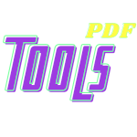

<!-- PROJECT LOGO -->
<br />
<p align="center">
  <a href="https://github.com/rusl2019/pdf-tools">
    
  </a>

  <h3 align="center">PDF Tools</h3>

  <p align="center">
    Alat untuk memanipulasi file PDF
    <br />
    Versi 1.0.0
    ·
    <a href="https://github.com/rusl2019/pdf-tools/issues">Melaporkan kesalahan</a>
    ·
    <a href="https://github.com/rusl2019/pdf-tools/issues">Permintaan fitur</a>
  </p>
</p>

<!-- TENTANG PROYEK -->

## Tentang Proyek

[![Product Name Screen Shot][product-screenshot]](https://github.com/rusl2019/pdf-tools/img/capture.png)

Proyek ini dimulai dengan pembuatan script untuk menggabungkan file PDF (merger PDF file) menggunakan versi CLI (Command Line Interface). selain itu untuk kebutuhan lain ditambahkan fitur "pemecahan" file pdf. pada saat yang bersamaan terpikirkan ide untuk membuat versi GUI (Graphic User Interface) untuk memudahkan pengguna lain.

## Fitur

- menggabungkan file PDF (merger)
- membagi file PDF (splitter)

## Dibangun dengan

Program ini di bangun menggunakan beberapa module python, diantaranya sebagai berikut:

- [Python 3](https://www.python.org/)
- [PyPDF2](http://mstamy2.github.io/PyPDF2/)

## Pengujian

Program ini di uji pada:

- sistem operasi Linux ([MX Linux](https://mxlinux.org/))
- menggunakan [anaconda python](https://www.anaconda.com/) versi 2020.11 


## Penggunaan

Penggunakan `Tools PDF` sangat mudah, seperti script python pada umumnya. pertama download repository atau clone repository

- git

```sh
git clone https://github.com/rusl2019/pdf-tools.git
```

kemudian jalankan script python

- python3
```sh
python3 pdf-tools.py
```

jika user menggunakan OS berbasis UNIX, dapat dilakukan dengan peritah:

- GUI
```sh
./pdf-tools.py
```
- CLI
```sh
./pdf-tools.py --help
```

untuk user yang ingin menginstall program di OS Windows dapat mendownload program di [link ini](https://github.com/rusl2019/pdf-tools/releases/download/v1.0.0/setup-Tools-PDF-ver1.0.0.exe)

## Lisensi

Didistribusikan di bawah Lisensi MIT. Lihat [`LISENSI`](https://github.com/rusl2019/pdf-tools/blob/main/LICENSE) untuk informasi lebih lanjut.

## Kontak

Muhammad Ruslan - muhammad.ruslan14@gmail.com - [website](https://rusl2019.github.io)

Project Link: [pdf-tools](https://github.com/rusl2019/pdf-tools)

## Ucapan Terima Kasih

- [GitHub Emoji Cheat Sheet](https://www.webpagefx.com/tools/emoji-cheat-sheet)
- [Img Shields](https://shields.io)
- [Choose an Open Source License](https://choosealicense.com)
- [GitHub Pages](https://pages.github.com)
- [Animate.css](https://daneden.github.io/animate.css)
- [Loaders.css](https://connoratherton.com/loaders)
- [Slick Carousel](https://kenwheeler.github.io/slick)
- [Smooth Scroll](https://github.com/cferdinandi/smooth-scroll)
- [Sticky Kit](http://leafo.net/sticky-kit)
- [JVectorMap](http://jvectormap.com)
- [Font Awesome](https://fontawesome.com)
- [Best README Template](https://github.com/othneildrew/Best-README-Template/)

[product-screenshot]: ./img/capture.png